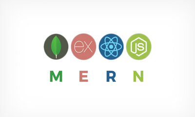
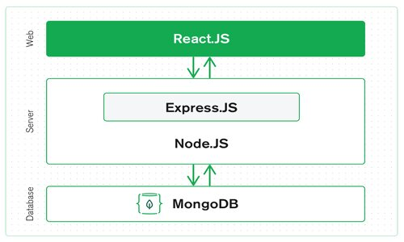
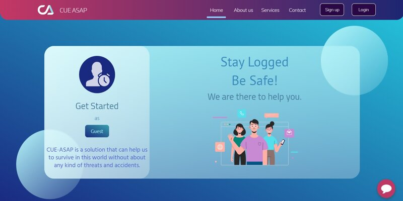

<!--
*** Thanks for checking out the Best-README-Template. If you have a suggestion
*** that would make this better, please fork the repo and create a pull request
*** or simply open an issue with the tag "enhancement".
*** Thanks again! Now go create something AMAZING! :D
-->


<!-- PROJECT SHIELDS -->
<!--
*** I'm using markdown "reference style" links for readability.
*** Reference links are enclosed in brackets [ ] instead of parentheses ( ).
*** See the bottom of this document for the declaration of the reference variables
*** for contributors-url, forks-url, etc. This is an optional, concise syntax you may use.
*** https://www.markdownguide.org/basic-syntax/#reference-style-links
-->
[![Contributors][contributors-shield]][contributors-url]
[![Forks][forks-shield]][forks-url]
[![Stargazers][stars-shield]][stars-url]
[![Issues][issues-shield]][issues-url]
[![MIT License][license-shield]][license-url]
[![LinkedIn][linkedin-shield]][linkedin-url]


<!-- PROJECT LOGO -->
<br />
<p align="center">
  <a href="https://github.com/CUE-ASAP/Main-Web">
    
  </a>

  <h3 align="center">CUE-ASAP</h3>
  <h4 align="center">(CA)</h4>

  <p align="center">
    <a href="https://github.com/CUE-ASAP/Main-Web"><strong>Explore the docs »</strong></a>
    <br />
    <br />
    <a href="https://github.com/CUE-ASAP/Main-Web">View Demo</a>
    ·
    <a href="https://github.com/CUE-ASAP/Main-Web/issues">Report Bug</a>
    ·
    <a href="https://github.com/CUE-ASAP/Main-Web/issues">Request Feature</a>
  </p>
</p>

---
---

<!-- TABLE OF CONTENTS -->
<details open="open">
  <summary>Table of Contents</summary>
  <ol>
    <li><a href="#abstract">Abstract</a>
    <li><a href="#built-with">Built With</a></li>
    <li><a href="#hardware-and-software-specification">Hardware and Software Specification</a></li>
    <li><a href="#CUE-ASAP-nomenclature">CUE-ASAP Nomenclature</a></li>
	<li><a href="#license">License</a></li>
	<li><a href="#screenshots">Screenshots</a></li>
    <li><a href="#contact">Contact</a></li>
  </ol>
</details>

---
---

<!-- ABSTRACT -->
## Abstract

```
    CUE ASAP is a solution that can help us to survive in this world without worrying
    about any kind of threats and accidents. The emergency happens without our unpredictable
    knowledge, so we tend to aid in that scenario by using this application. The issue of 
    violence is one of the major real-world problems that every human face. To solve all kinds 
    of threats to mankind, CUE ASAP might come in handy. All the required information to protect 
    a person is at hand which is a smartphone. At Least if, we can predict 3 minutes of the 
    future it can really save many precious lives.

    As per the degree of emergency, the help will be provided by using an AI chatbot CUE Assist.
    Each color represents an emergency, which can be shown in front of a surveillance camera or
    click the respective situation. This is programmed to report the selected situation to nearby
    authority as soon as possible. Thanks to any smart device with a camera and CUE ASAP. It can
    help with people who need of an assist. From this project, we hope to build an application
    that aids people in emergencies. 
```

---

## Built With

  <p align="center">
    
  </p>
  <br/>

>  MERN stands for MongoDB, Express, React, Node, after the four key technologies that make up the stack. 
  
  <br />

  > <div align="left" style="display:inline; white-space:nowrap;"> 
  <a href="https://docs.mongodb.com/" target="_blank" ></a>
  </div>

  > <div align="left" style="display:inline; white-space:nowrap;"> 
  <a href="https://expressjs.com/en/5x/api.html" target="_blank" ></a>
  </div>

  > <div align="left" style="display:inline; white-space:nowrap;"> 
  <a href="https://reactjs.org/docs/getting-started.html" target="_blank" ></a>
  </div>

  > <div align="left" style="display:inline; white-space:nowrap;"> 
  <a href="https://nodejs.org/en/docs/" target="_blank" ></a>
  </div>

---

<!-- HARDWARE AND SOFTWARE SPECIFICATION  -->
## Hardware and Software Specification

    HARDWARE REQUIREMENTS 

        System : 2.40 GHz^ 
        Internet : Wi-Fi (2.5 G ^) / Mobile data (3G ^) 
        Browser Version : Chrome v64 ^, Firefox v58 ^, Microsoft Edge v42 ^, Opera v50 ^, Safari v12 ^. 
        Monitor : 800*600 VGA Colour 
        Mouse : Any 
        Ram : 512 Mb^ 
  
 
    SOFTWARE REQUIREMENTS 

        Operating system : Windows 10 
        IDE : Visual Studio Code 
        Coding Language : JavaScript, HTML, CSS 
        Frontend : React, Bootstrap, Redux. 
        Backend : MongoDB (NoSQL) with Node.js and Express.js. 

<p align="center">
    
</p>

---

<!--CUE-ASAP NOMENCLATURE -->
## CUE-ASAP Nomenclature

    1. CUE ASAP - Application Name 
    2. CUE Assist - AI Chat bot 
    3. CUE Community - Contributions to CUE ASAP 
    4. CUE Dev - Team of Developers 
    5. CUE Member - Registered User in CUE ASAP 
    6. CUE Mentor - Trusted adviser of CUE ASAP 
    7. CUE Notify - Automated Email bot 

---

<!-- LICENSE -->
## License

    Distributed under the MIT License. See `LICENSE` for more information.

---

<!-- SCREENSHOTS -->
## Screenshots

<p align="center">
  <div style="display:inline; white-space:nowrap;"> 
   
   <br />
  </div>
</p> 

---

<!-- CONTACT -->
<br />
## Contact

    CUE Dev :   Vimal Kannan (vk2049627@gmail.com) - Full Stack Developer
                Joshua Prem Cyril (joshua.cyril88@gmail.com) - AI Data Analyst
                Dinesh Kumar (dineshrdk07@gmail.com) - Web Testing Executive


    Project Link: [https://cueasap.xyz](https://cueasap.xyz)


<!-- MARKDOWN LINKS & IMAGES -->
<!-- https://www.markdownguide.org/basic-syntax/#reference-style-links -->
[contributors-shield]: https://img.shields.io/github/contributors/CUE-ASAP/Main-Web.svg?style=for-the-badge
[contributors-url]: https://github.com/CUE-ASAP/Main-Web/graphs/contributors
[forks-shield]: https://img.shields.io/github/forks/CUE-ASAP/Main-Web.svg?style=for-the-badge
[forks-url]: https://github.com/CUE-ASAP/Main-Web/network/members
[stars-shield]: https://img.shields.io/github/stars/CUE-ASAP/Main-Web.svg?style=for-the-badge
[stars-url]: https://github.com/CUE-ASAP/Main-Web/stargazers
[issues-shield]: https://img.shields.io/github/issues/CUE-ASAP/Main-Web.svg?style=for-the-badge
[issues-url]: https://github.com/CUE-ASAP/Main-Web/issues
[license-shield]: https://img.shields.io/github/license/CUE-ASAP/Main-Web.svg?style=for-the-badge
[license-url]: https://github.com/CUE-ASAP/Main-Web/blob/main/LICENSE
[linkedin-shield]: https://img.shields.io/badge/-LinkedIn-black.svg?style=for-the-badge&logo=linkedin&colorB=555
[linkedin-url]: https://linkedin.com/in/Vk-Demon